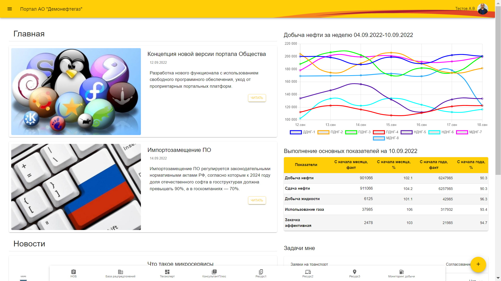
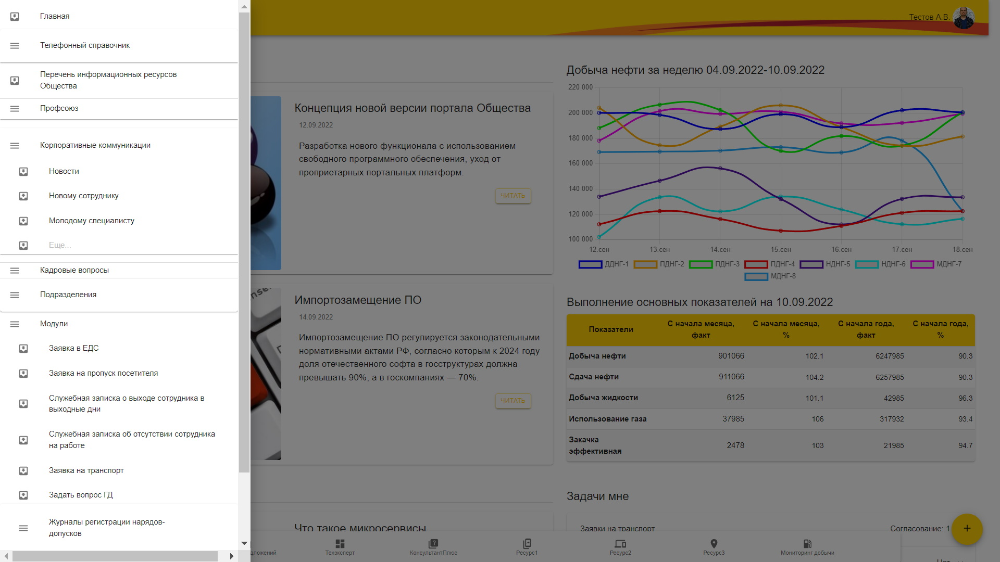
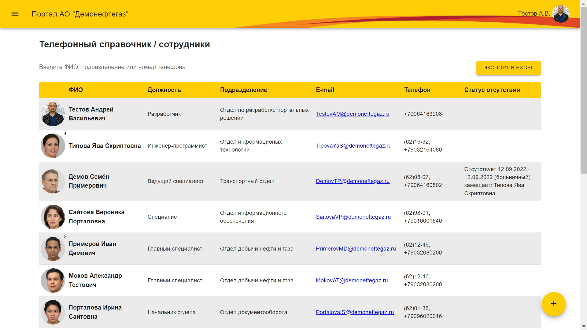
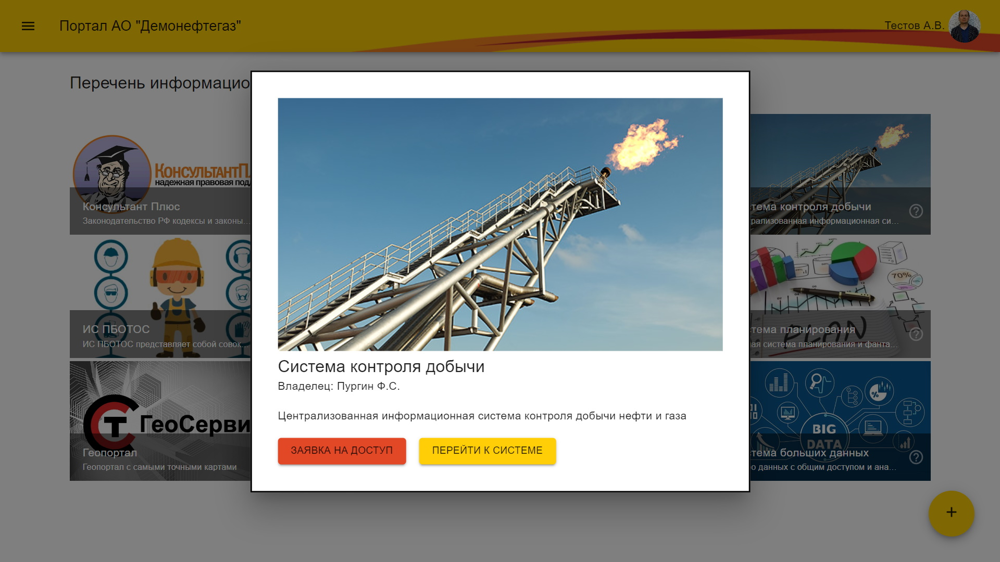
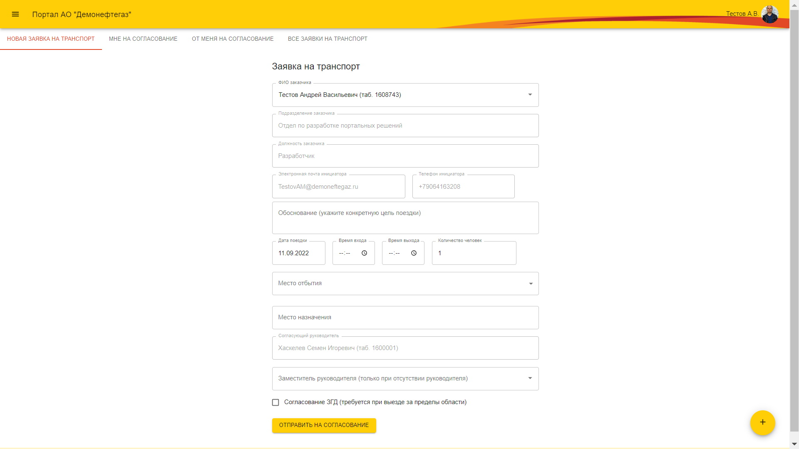
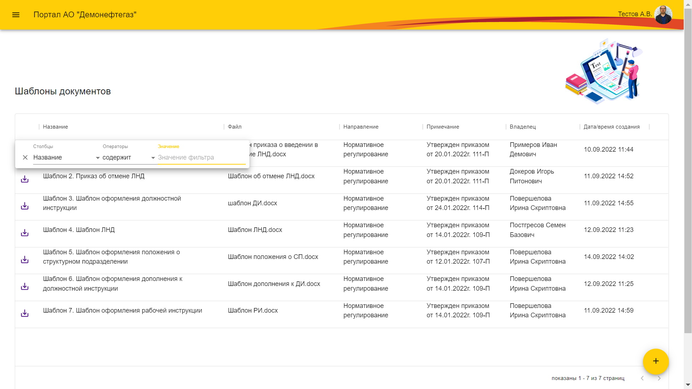
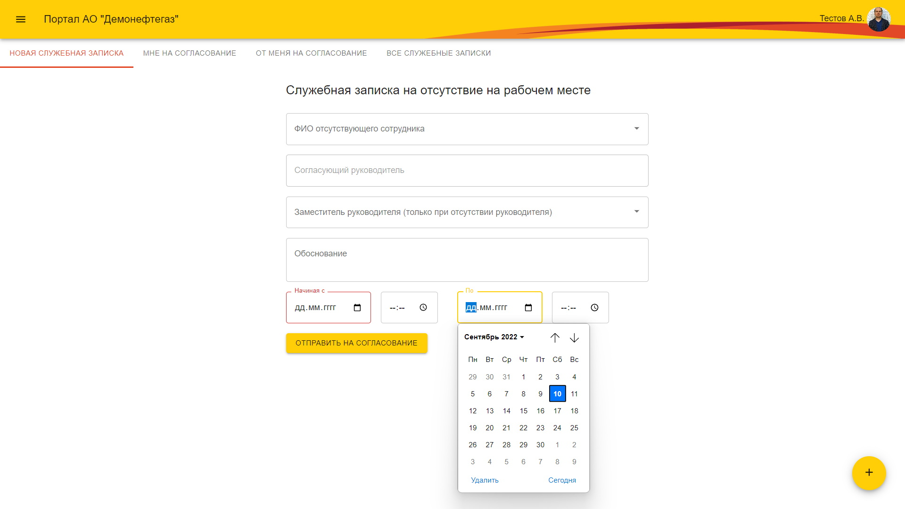
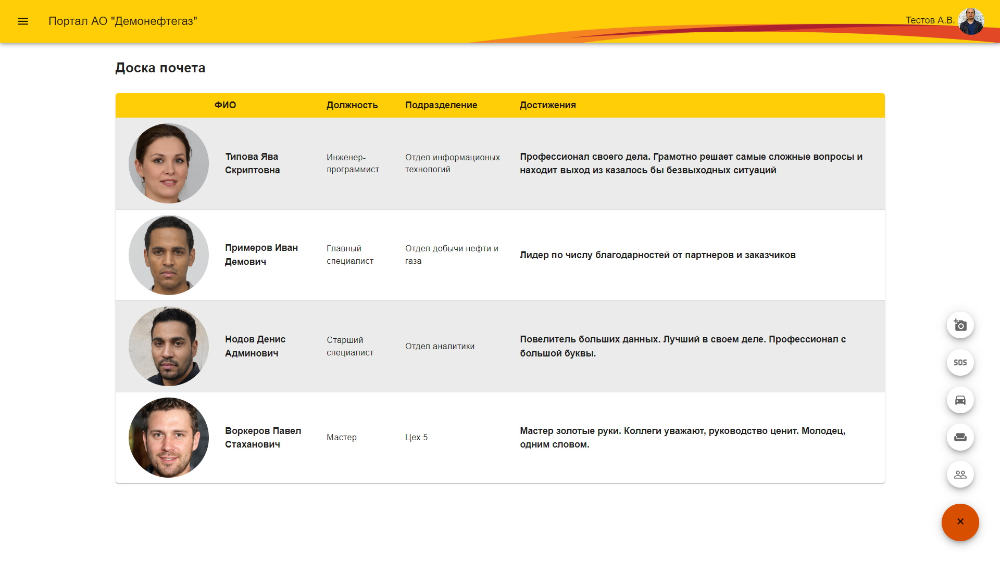
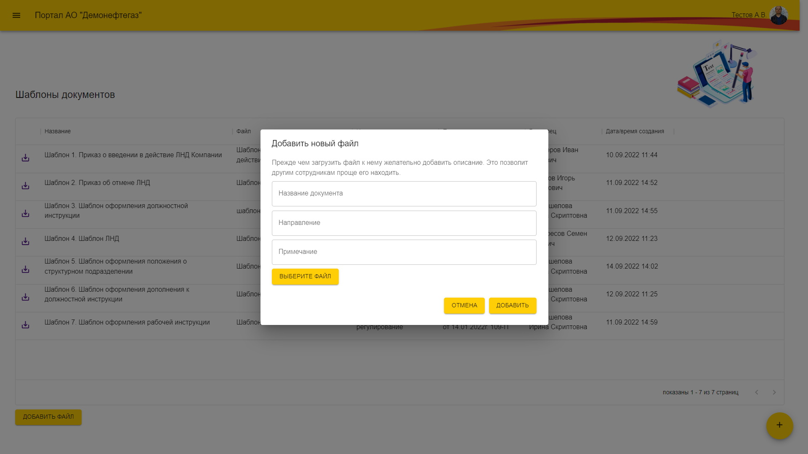

# Портал АО "Демонефтегаз"

Frontend портала АО "Демонефтегаз". Используется Typescript/React/Mobx/Material UI/Chart.js.

Реализованы:
- телефонный справочник c поиском, карточки сотрудников
- справочник официальных ящиков подразделений (приемные руководителей)
- новостной блок
- виджет с информацией о выполнении производственных показателей
- личный кабинет сотрудника с доступом к документам по категориям
- различные виды заявок (на транспорт, на пропуск посетителя, в ЕДС
- создание и согласование СЗ о работе в выходной день и об отсутствии на работе
- журналы регистрации нарядов-допусков
- обратная связь для ГД
- компонент для работы с документами на примере разделов "Шаблоны документов", "Новому сотруднику", "Станлдартные формы договоров", "Молодому специалисту" и т.п.

